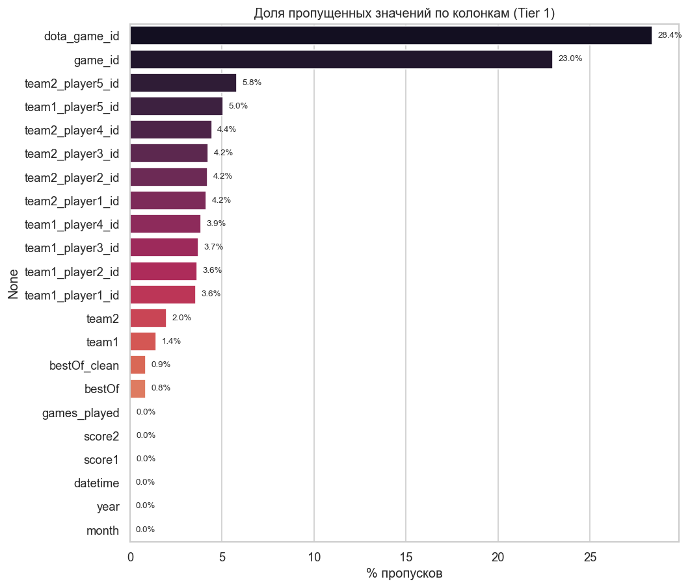
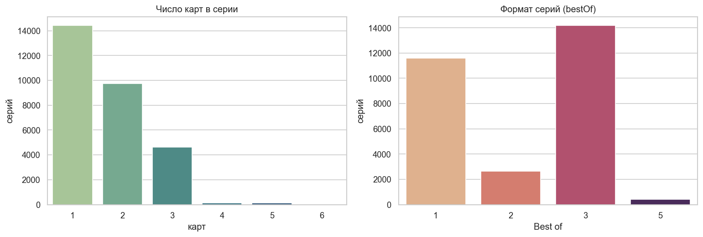
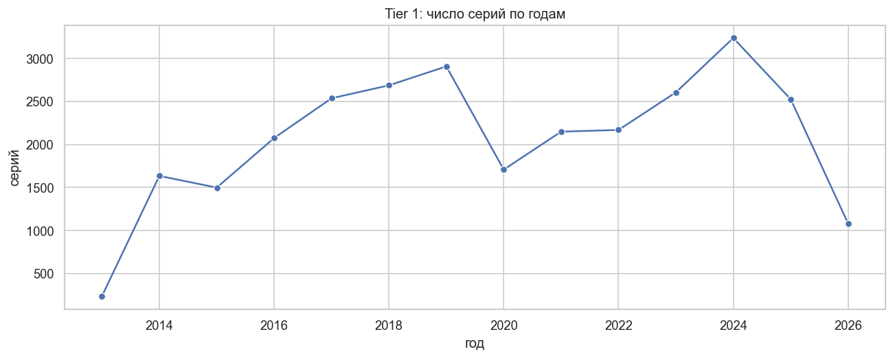
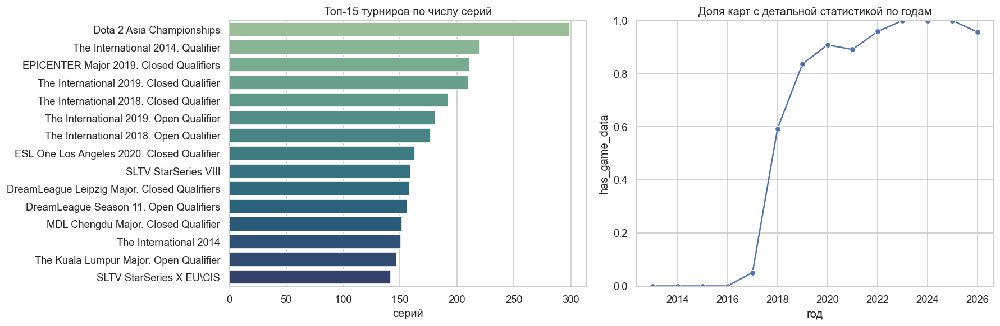
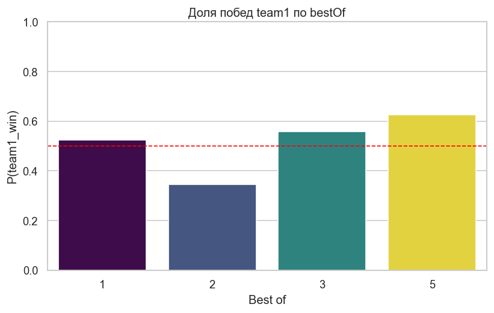
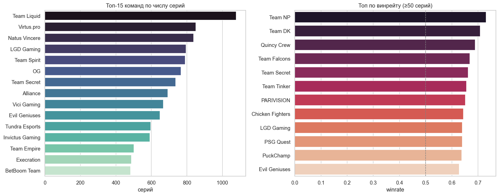
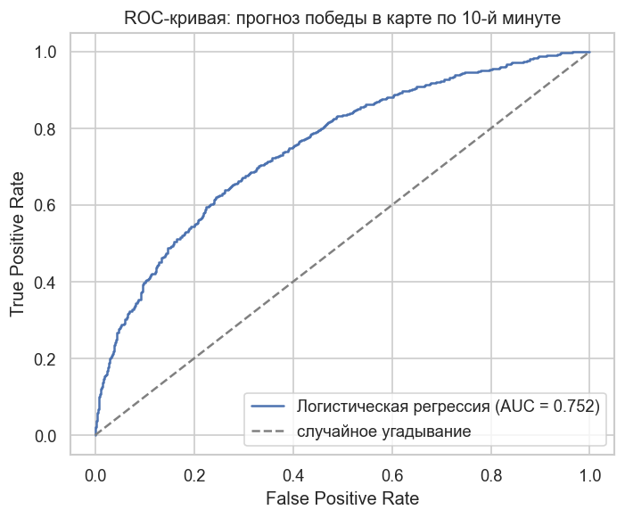
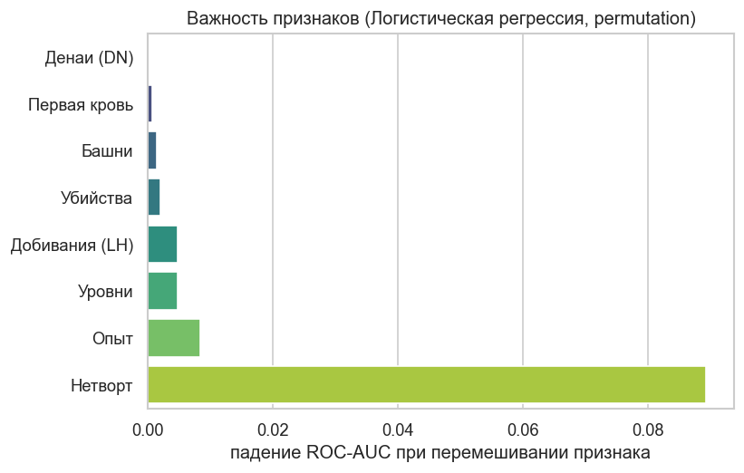
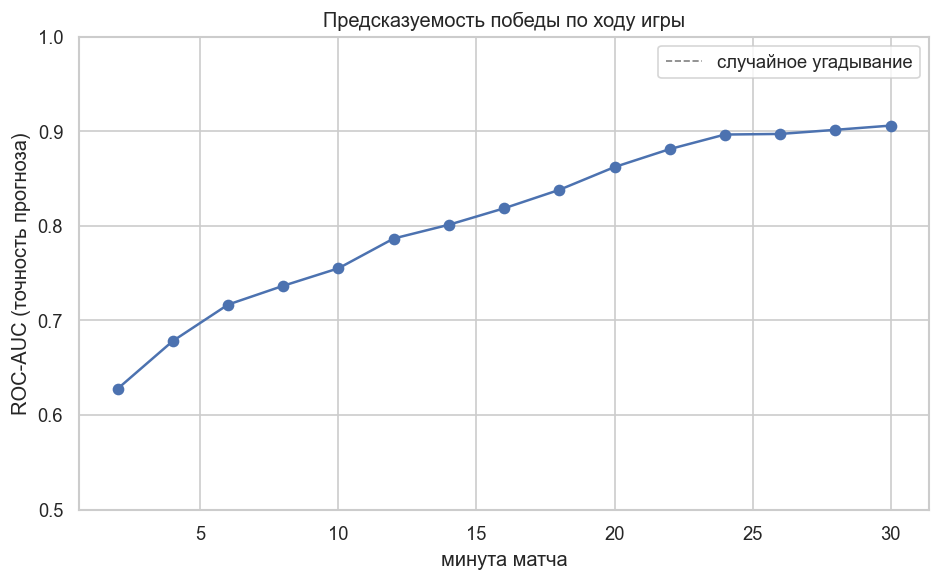
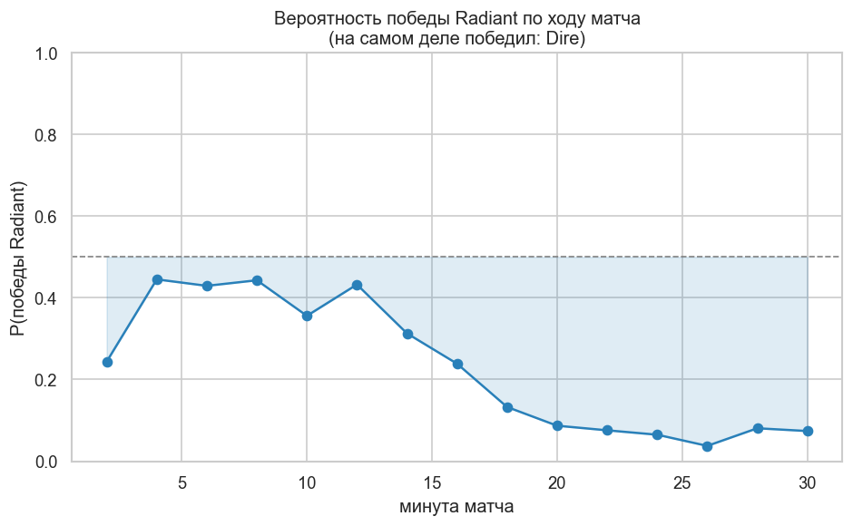

<div align="center">

# Dota 2 Pro Matches — EDA + прогноз победы

**Разведочный анализ профессиональных матчей Dota 2, сравнение моделей и кривая вероятности победы по ходу игры**

Загрузка датасета с Kaggle, EDA, выгрузка детальной статистики матчей через OpenDota API,
сравнение нескольких моделей прогноза победы и построение **live win-probability** —
вероятности победы на каждой минуте матча.


</div>

---

## Содержание

- [О проекте](#о-проекте)
- [Данные](#данные)
- [Что делает код](#что-делает-код)
- [Результаты EDA](#результаты-eda)
- [Сравнение моделей (10-я минута)](#сравнение-моделей-10-я-минута)
- [Кривая вероятности победы (win-probability)](#кривая-вероятности-победы-win-probability)
- [Структура репозитория](#структура-репозитория)
- [Запуск](#запуск)
- [Источники данных](#источники-данных)

---

## О проекте

Проект из трёх частей:

1. **EDA** — разведочный анализ профессиональных матчей **Dota 2**: структура датасета,
   качество данных (пропуски, типы), распределения, временные тренды, баланс таргета.
2. **Сравнение моделей** — по состоянию игры на 10-й минуте предсказываем победителя
   карты и сравниваем логистическую регрессию с градиентным бустингом на кросс-валидации.
3. **Win-probability** — обобщаем прогноз на весь матч и строим кривую вероятности
   победы по минутам (как на турнирных трансляциях).

Детальная статистика каждой карты берётся напрямую из
[OpenDota API](https://docs.opendota.com/) — вплоть до драфта (picks/bans),
графиков преимущества по золоту/опыту и поминутной статистики игроков.

---

## Данные

Базовый датасет: **[Dota 2 Pro Matches](https://www.kaggle.com/datasets/ektarr/dota-2-pro-matches)** (Kaggle),
загружается автоматически через [`kagglehub`](https://github.com/Kaggle/kagglehub):

| Файл | Содержание |
| --- | --- |
| `teams.csv` | Профессиональные команды |
| `tournaments.csv` | Турниры и лиги |
| `players.csv` | Игроки |
| `tier1_games.csv` | Матчи топового уровня (Tier 1) |

Для моделей по `dota_game_id` дополнительно скачивается **полный JSON** каждой карты
из OpenDota API: `picks_bans`, `radiant_win`, поминутные массивы `gold_t`/`xp_t`/`lh_t`
у игроков и многое другое.

---

## Что делает код

| Скрипт | Назначение |
| --- | --- |
| [`eda.py`](eda.py) | EDA по `tier1_games.csv`: очистка, пропуски, распределения, тренды, графики |
| [`collect_matches.py`](collect_matches.py) | Массовая выгрузка детальной статистики матчей из OpenDota в `matches/` |
| [`model.py`](model.py) | Признаки на 10-й минуте → **сравнение моделей** (логрегрессия vs бустинг) на CV |
| [`winprob.py`](winprob.py) | **Кривая вероятности победы**: модель на каждой минуте матча |

---

## Результаты EDA

> Данные: **`tier1_games.csv`** — грейн «1 строка = 1 карта внутри серии».
> Серийные поля (`team1_win`, `score`, `bestOf`) повторяются по строкам-картам,
> поэтому для серийной аналитики строки дедуплицируются по `match_id`.

**Пропуски в данных**



**Формат серий и число карт**



Преобладают Bo3 и Bo1; Bo5 — финалы и решающие матчи.

**Динамика по годам и покрытие детальной статистикой**





Доля карт с детальной статистикой (`has_game_data`) выросла с ~0 до 2017 года
до ~100 % к последним сезонам — у старых матчей подробных данных OpenDota нет.

**Баланс таргета и команды**





Доля побед `team1` заметно выше 0.5 и зависит от формата — значит, **порядок
`team1`/`team2` несёт информацию** (вероятно, `team1` — фаворит/верхняя сетка).
Это потенциальная утечка, поэтому модели обучаются на нейтральном таргете
`radiant_win` (победа стороны Radiant), а не на `team1_win`.

---

## Сравнение моделей (10-я минута)

**Задача:** по состоянию игры на 10-й минуте предсказать, победит ли Radiant
(`radiant_win` = 1).

**Признаки** — перевес Radiant над Dire на 10-й минуте:
нетворт, опыт, добивания (LH), денаи (DN), убийства, суммарные уровни,
разрушенные башни и первая кровь.

**Что сравниваем** — две модели на **5-блочной кросс-валидации**, плюс простое
правило для ориентира:

| Подход | Accuracy | ROC-AUC |
| --- | --- | --- |
| Базовое правило (`нетворт > 0`) | 0.672 | — |
| Градиентный бустинг (`HistGradientBoosting`) | 0.675 | 0.734 |
| **Логистическая регрессия** | **0.684** | **0.752** |

*(выборка ~1900 карт; метрики — среднее по 5 фолдам)*

Лучшей оказывается **логистическая регрессия**: связь «перевес → победа» почти
линейная, поэтому бустинг не даёт преимущества. Модель лишь немного обгоняет
простое правило — это закономерно: в Tier 1 играют команды близкого уровня, и
перевес на 10-й минуте ещё не решает исход. Графики результата:




Важность признаков считается через **permutation importance** (работает для любой
модели). Сильнее всего влияют **нетворт** и **опыт**; башни/первая кровь/денаи
почти не добавляют сигнала. Матрица ошибок и связь «перевес по золоту → доля
побед» сохраняются в `figures/` (`09`, `10`).

---

## Кривая вероятности победы (win-probability)

Скрипт [`winprob.py`](winprob.py) обобщает идею на **весь матч**: для каждой минуты
строится свой «снимок» игры и обучается своя логистическая регрессия. Так на любой
минуте можно выдать вероятность победы Radiant.

**Предсказуемость растёт по ходу игры** — ROC-AUC по минутам:

| Минута | 2 | 10 | 20 | 30 |
| --- | --- | --- | --- | --- |
| ROC-AUC | 0.63 | 0.76 | 0.86 | 0.91 |



На 2-й минуте исход почти не определён, к 30-й — предсказуем уверенно.

**Кривая для одного матча** (отложенный пример, в обучение не входит): вероятность
победы Radiant по минутам сходится к фактическому победителю.



> ⚠️ На поздних минутах матчей меньше (короткие игры до них не доходят) — это
> *selection bias*, он виден в колонке «матчей» при запуске `winprob.py`.

---

## Структура репозитория

```
Dota-2-Matches-Dataset/
├── eda.py               # EDA: очистка, анализ, графики
├── collect_matches.py   # Массовая выгрузка матчей в matches/ (для моделей)
├── model.py             # 10-я минута: сравнение моделей (логрег vs бустинг)
├── winprob.py           # Кривая вероятности победы по ходу игры
├── requirements.txt     # Зависимости проекта
├── figures/             # Сохранённые графики (.png)
├── matches/             # Скачанные матчи (JSON, не в гите — создаётся скриптом)
├── 8823581121           # Пример матча из OpenDota (для демо-прогнозов)
└── README.md
```

---

## Запуск

```bash
# 1. Окружение и зависимости
python -m venv .venv
source .venv/bin/activate        # Windows: .venv\Scripts\activate
pip install -r requirements.txt

# 2. EDA: отчёт в консоль + графики в figures/
python eda.py

# 3. Скачать матчи для моделей (один раз; качается в matches/)
python collect_matches.py 2000   # ~2000 карт через OpenDota API

# 4. Сравнение моделей на 10-й минуте
python model.py

# 5. Кривая вероятности победы по ходу игры
python winprob.py
```

---

## Источники данных

- Датасет: [Dota 2 Pro Matches — Kaggle](https://www.kaggle.com/datasets/ektarr/dota-2-pro-matches)
- API: [OpenDota API](https://docs.opendota.com/)

---

<div align="center">

Если проект оказался полезен — поставьте звезду!

</div>
