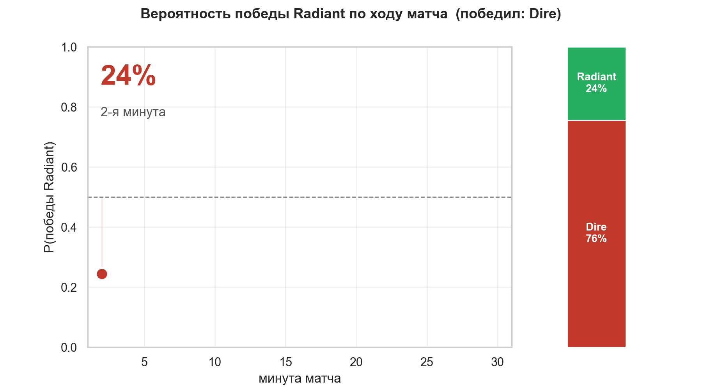
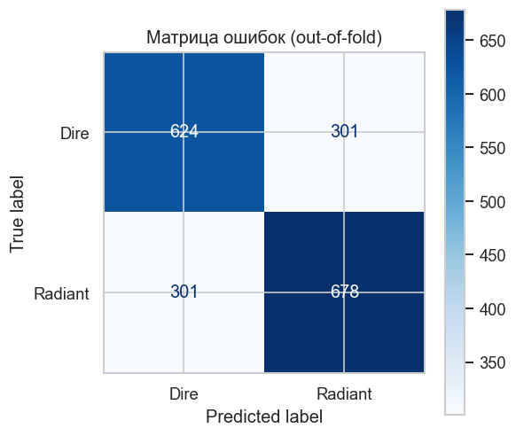
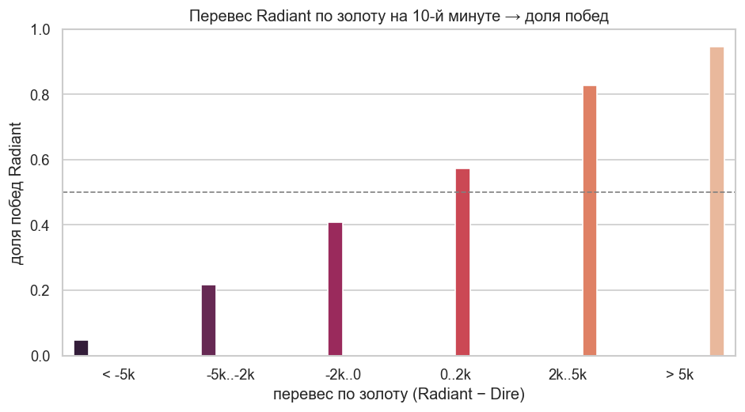

<div align="center">

# Dota 2 Pro Matches — EDA и прогноз победы

**Разведочный анализ профессиональных матчей Dota 2, сравнение моделей и кривая вероятности победы по ходу игры**


<br>



<sub>Вероятность победы Radiant обновляется минута за минутой — как live win-probability на трансляциях.</sub>

</div>

---

## Содержание

- [О проекте](#о-проекте)
- [Данные](#данные)
- [Что делает код](#что-делает-код)
- [Результаты EDA](#результаты-eda)
- [Сравнение моделей (10-я минута)](#сравнение-моделей-10-я-минута)
- [Кривая вероятности победы](#кривая-вероятности-победы)
- [Структура репозитория](#структура-репозитория)
- [Запуск](#запуск)
- [Источники данных](#источники-данных)

---

## О проекте

Проект состоит из трёх частей:

1. **EDA** — разведочный анализ профессиональных матчей Dota 2: структура датасета, качество данных (пропуски, типы), распределения, временные тренды и баланс таргета.
2. **Сравнение моделей** — по состоянию игры на 10-й минуте предсказываем победителя карты; сравниваем логистическую регрессию и градиентный бустинг на кросс-валидации.
3. **Win-probability** — обобщаем прогноз на весь матч и строим кривую вероятности победы по минутам.

Детальная статистика каждой карты берётся напрямую из [OpenDota API](https://docs.opendota.com/): драфт (picks/bans), поминутные графики золота и опыта, статистика игроков.

---

## Данные

Базовый датасет: **[Dota 2 Pro Matches](https://www.kaggle.com/datasets/ektarr/dota-2-pro-matches)** (Kaggle), загружается автоматически через [`kagglehub`](https://github.com/Kaggle/kagglehub):

| Файл | Содержание |
| --- | --- |
| `tier1_games.csv` | Матчи топового уровня (Tier 1) — основа EDA |
| `teams.csv` | Профессиональные команды |
| `tournaments.csv` | Турниры и лиги |
| `players.csv` | Игроки |

Для моделей по `dota_game_id` дополнительно скачивается полный JSON каждой карты из OpenDota: `picks_bans`, `radiant_win`, поминутные массивы `gold_t` / `xp_t` / `lh_t` у игроков.

---

## Что делает код

| Скрипт | Назначение |
| --- | --- |
| [`eda.py`](eda.py) | EDA по `tier1_games.csv`: очистка, пропуски, распределения, тренды, графики |
| [`collect_matches.py`](collect_matches.py) | Массовая выгрузка детальной статистики матчей из OpenDota в `matches/` |
| [`model.py`](model.py) | Признаки на 10-й минуте, сравнение моделей (логрегрессия и бустинг) на кросс-валидации |
| [`winprob.py`](winprob.py) | Кривая вероятности победы: своя модель на каждой минуте матча |

---

## Результаты EDA

Грейн данных: «1 строка = 1 карта внутри серии». Серийные поля (`team1_win`, `score`, `bestOf`) повторяются по строкам-картам, поэтому для серийной аналитики строки дедуплицируются по `match_id`.

**Пропуски в данных**


**Формат серий и число карт**


Преобладают Bo3 и Bo1; Bo5 — финалы и решающие матчи.

**Динамика по годам и покрытие детальной статистикой**


Доля карт с детальной статистикой (`has_game_data`) выросла с почти нуля до 2017 года до ~100 % к последним сезонам — у старых матчей подробных данных OpenDota нет.

**Баланс таргета**


Доля побед `team1` заметно выше 0.5 и зависит от формата. Значит, порядок `team1`/`team2` несёт информацию (вероятно, `team1` — фаворит) — это потенциальная утечка, поэтому модели учатся на нейтральном таргете `radiant_win`, а не на `team1_win`.

**Команды**


---

## Сравнение моделей (10-я минута)

**Задача:** по состоянию игры на 10-й минуте предсказать, победит ли Radiant (`radiant_win = 1`).

**Признаки** — перевес Radiant над Dire на 10-й минуте: нетворт, опыт, добивания (LH), денаи (DN), убийства, суммарные уровни, разрушенные башни, первая кровь.

**Готовый результат** — сравнение на 5-блочной кросс-валидации:

```text
--- Сравнение моделей (5-блочная кросс-валидация) ---
Доля Radiant-побед в данных : 0.514
Базовое правило (нетворт>0) : accuracy = 0.672
Логистическая регрессия     : accuracy = 0.684 ± 0.016 | ROC-AUC = 0.752 ± 0.015
Градиентный бустинг         : accuracy = 0.675 ± 0.024 | ROC-AUC = 0.734 ± 0.017

Лучшая модель: Логистическая регрессия (ROC-AUC = 0.752)
```

| Подход | Accuracy | ROC-AUC |
| --- | :---: | :---: |
| Базовое правило (`нетворт > 0`) | 0.672 | — |
| Градиентный бустинг | 0.675 | 0.734 |
| **Логистическая регрессия** | **0.684** | **0.752** |

Лучшей оказывается логистическая регрессия: связь «перевес — победа» почти линейная, поэтому бустинг не даёт преимущества.

**ROC-кривая**


**Важность признаков (permutation importance)**


Сильнее всего влияют нетворт и опыт; башни, первая кровь и денаи почти не добавляют сигнала.

**Матрица ошибок**



**Связь перевеса по золоту и доли побед**



---

## Кривая вероятности победы

[`winprob.py`](winprob.py) обобщает идею на весь матч: для каждой минуты строится свой снимок игры и обучается своя логистическая регрессия. Так на любой минуте можно выдать вероятность победы Radiant.

**Готовый результат** — предсказуемость растёт по ходу игры:

```text
 минута   матчей   ROC-AUC
      2     1904     0.628
      6     1904     0.717
     10     1903     0.755
     14     1901     0.801
     18     1885     0.838
     22     1838     0.881
     26     1702     0.897
     30     1476     0.906
```

**Предсказуемость победы по ходу игры**


На 2-й минуте исход почти не определён (AUC 0.63), к 30-й — предсказуем уверенно (AUC 0.91).

**Кривая вероятности для матча-примера**


Для отложенного матча (в обучение не входит) вероятность победы Radiant по минутам сходится к фактическому победителю.

> Замечание: на поздних минутах матчей меньше (короткие игры до них не доходят) — это selection bias, он виден в колонке «матчей» при запуске `winprob.py`.

---

## Структура репозитория

```
Dota-2-Matches-Dataset/
├── eda.py               # EDA: очистка, анализ, графики
├── collect_matches.py   # Массовая выгрузка матчей в matches/ (для моделей)
├── model.py             # 10-я минута: сравнение моделей (логрегрессия и бустинг)
├── winprob.py           # Кривая вероятности победы по ходу игры
├── requirements.txt     # Зависимости проекта
├── figures/             # Сохранённые графики (.png)
├── matches/             # Скачанные матчи (JSON, не в гите — создаётся скриптом)
├── 8823581121           # Пример матча из OpenDota (для демо-прогнозов)
└── README.md
```

---

## Запуск

```bash
# 1. Окружение и зависимости
python -m venv .venv
source .venv/bin/activate        # Windows: .venv\Scripts\activate
pip install -r requirements.txt

# 2. EDA: отчёт в консоль + графики в figures/
python eda.py

# 3. Скачать матчи для моделей (один раз; качается в matches/)
python collect_matches.py 2000   # ~2000 карт через OpenDota API

# 4. Сравнение моделей на 10-й минуте
python model.py

# 5. Кривая вероятности победы по ходу игры
python winprob.py
```

---

## Источники данных

- Датасет: [Dota 2 Pro Matches — Kaggle](https://www.kaggle.com/datasets/ektarr/dota-2-pro-matches)
- API: [OpenDota API](https://docs.opendota.com/)
